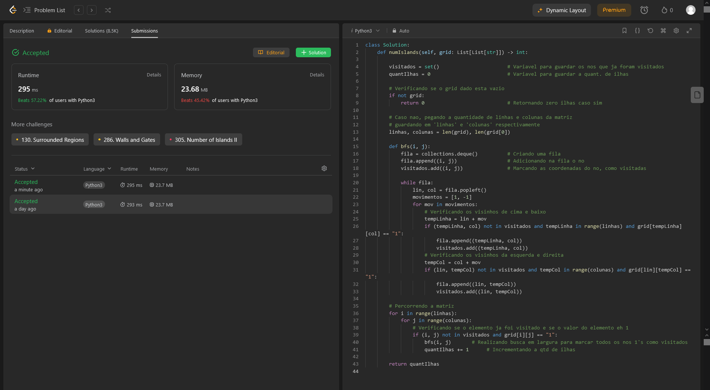
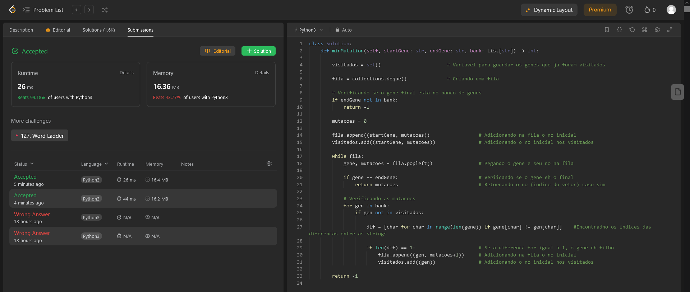
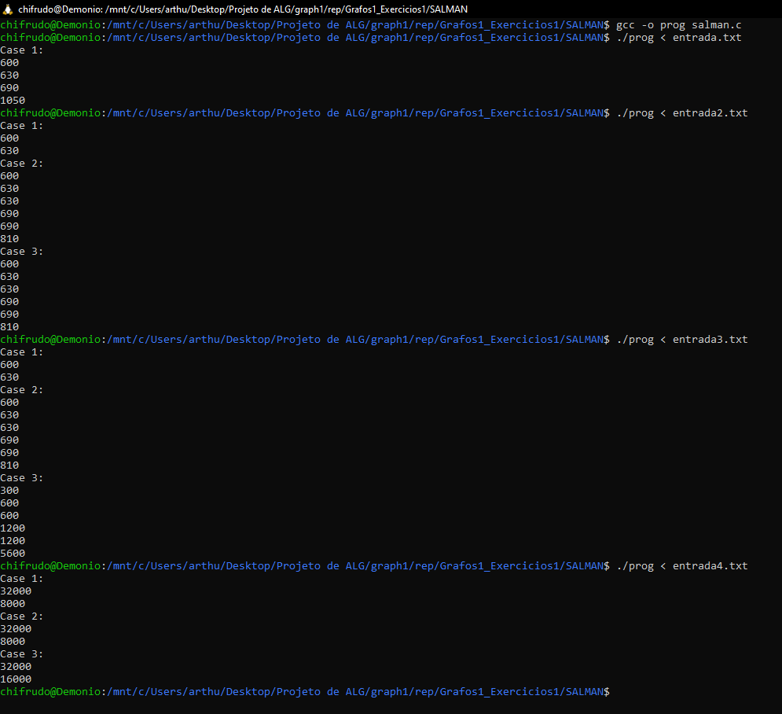

# Exercicios1

**Número da Lista**: X 
**Conteúdo da Disciplina**: BFS, DFS 

## Alunos

| Matrícula  | Aluno                       |
| ---------- | --------------------------- |
| 21/1029147 | Arthur de Melo Viana        |
| 21/1029666 | Matheus Henrique Dos Santos |

## Sobre

Exercícios do Sphere Online Judge:

- [LABYR1 - Labyrinth](https://www.spoj.com/problems/LABYR1/)
- [SALMAN - Salary Management](https://www.spoj.com/problems/SALMAN/) (TLE, mas funciona corretamente)
- [Longest Path in a Tree](https://www.spoj.com/problems/PT07Z/)

Exercícios do LeetCode:

- [200. Number of Islands](https://leetcode.com/problems/number-of-islands/description/)
- [433. Minimum Genetic Mutation](https://leetcode.com/problems/minimum-genetic-mutation/description/)

## Screenshots

Segue a seguir as imagens dos algoritmos enviados no juiz. É possível observar os status de conclusão do problema e o algoritmo enviado.

### Number of Islands

### Minimum Genetic Mutation

### LABYR1 - Labyrinth

### SALMAN - Salary Management

### PT07Z - Longest path in a tree

## Instalação

**Linguagem**: C, Python 

Para rodar os arquivos em C, é recomendado utilizar o WSL no Windows. Nele, execute o comando `sudo apt update` e `sudo apt install gcc`.

## Uso

Para os exercícios em C, compile o código utilizando `gcc -o prog arquivo.c` e execute utilizando `./prog` e digite o input no terminal, ou `./prog < entrada.txt` caso exista algum caso de teste contido no txt. Os links para os problemas estão na seção "Sobre".

## Outros

Quaisquer outras informações sobre seu projeto podem ser descritas abaixo.
